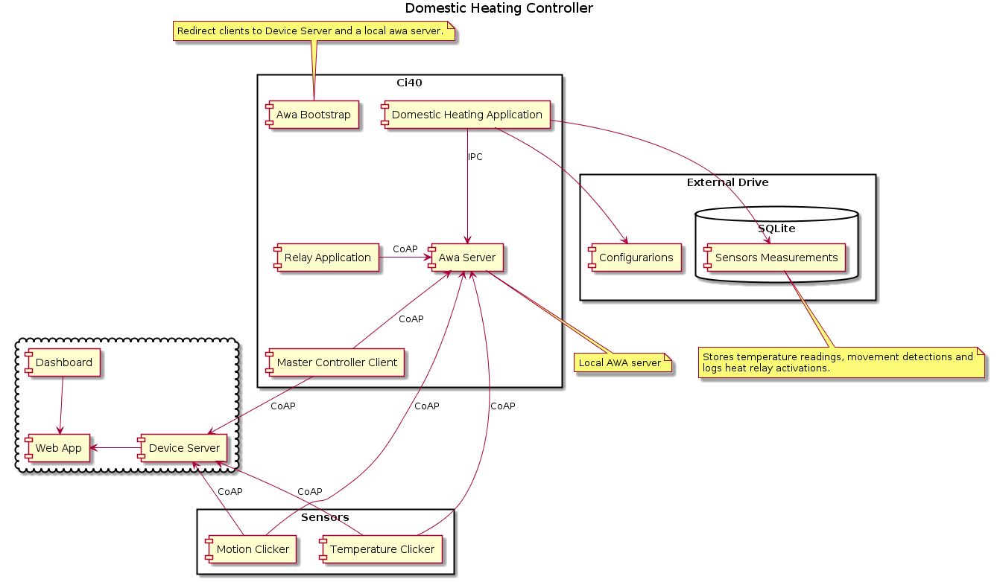

# Ci40 Domestic Heating Controller

## Overview <a name="overview"></a>
Ci40 Domestic Heating Controller is an example IoT system running on the Ci40. It is one of the embedded components of a larger system of temperature monitoring and control. The other components for this project include:
Temperature and Motion sensors using AwaLWM2M to provide IPSO objects for the sensor status, [cloud based back-end](https://github.com/CreatorDev/w5-domesticHeatingWebApp) and
[front-end](https://github.com/CreatorDev/w5-domesticHeatingDashboard).

The main aim of this application is to provide heating control logic that interacts
with a relay and two remote sensors (temperature and motion).
The system has been designed to collect temperature data from a thermo3 Click running on a different wireless board that is provided to the user's Creator Device Server account, store the temperature data in a local
SQLite database, and overlay movement events triggered from a Click proximity sensor running on another wireless, provided board.

The [heating schedule](#time_schedule_format) for the home should be configurable by the user - even if Internet access is lost.

For more information refer to the [architecture design](#architecture) section.

## Architecture <a name="architecture"></a>
The following diagram shows how this Ci40 application fits within the IoT Framework and which components
it is interacting with.



Components:
* Ci40:
  * LWM2M server running locally: processes traffic between remote sensors
and the logic running on the Ci40.
  * Awa Bootstrap Service: redirects clients to a local awa server and to cloud based Device Server.
  For more information how to set up multi-bootstrap configuration refer to [environment setup](#env_setup).
  * Master Controller Client: awa client responsible for exposing user defined configuration and system change events.
    IPSO definition:
      * 20011/0/5823: Custom event - event identifier
      * 20010/0/3500: Heating schedule configuration
      * 20010/0/3501: Temperature sensor ID
      * 20010/1/3500: Motion Sensor ID
      * 20010/2/3500: Relay Controller ID

  * Relay application: responsible for changing relay state.
    IPSO definition:
      * 3201/0/5550: Digital output state

  * SQLite database: stores time indexed temperature readings, movement logs, heat relay activation.

* Cloud:
  * Device Server: stores recent sensor values and configuration.

  * Web App: cloud based backend.
    Responsible for:
      * observing sensors and storing readings in influx database,
      * provides Graphana configuration,
      * exposing REST Api for Dashboard component.

  * Dashboard: provides web page that allows the configuration of:
      * heating schedule,
      * delta for temperature sensors.

## Environment setup <a name="env_setup"></a>

As shown on the 'Architecture design diagram' the application requires
additional components to be set up (e.g. local awa server, relay application or motion
and temperature clients, db, etc.).

### Prerequisites
!!! This project requires usage of external memory drive that will be used to store local database. !!!

1. Copy the application binary and the content of the 'scripts' folder to your Ci40 working directory:
  `scp scripts* root@<ip>:~/ci40-project5 `
1. Login to your board
1. Enter your working directory e.g. `~/ci40-project5`
1. Prepare an external drive and connect it to the Ci40
1. Run `./prepare.sh`
   This script will mount your USB drive and create `ci40-project5` folder on root of your drive.
1. Copy `timeSchedule.txt` and `default.cfg` there.


### Setting up environment

The next step is to set up the rest of the components that our application is interacting with. To do that we need to:
* launch 'awa_serverd'
* launch 'awa_bootstrapd' with multiple bootstrap configuration ('-c' option) using `project5-ds.bsc` and `project5-localhost.bsc`.
* run ./defineObjects.sh
* set up awa clients

or just simply:

* run `setupEnvironment.sh -a your_board_ip`

!!! In case of any problems with configuring bootstrap please check next section that covers how to set up local test environment. !!!

### Test environment
To help with setting up a local test environment a script called `setupEnvironment.sh` has been provided.
It's main responsibilities are to:
 - setup local awa server running on CoAP port 5700 and IPC port 50000,
 - setup awa bootstrap that redirects connected clients to local awa server and device server
 - setup temperature, motion and relay clients to interact with the program ( -t option ).

 IMPORTANT: it is required to rename `psk.properties.sample` to `psk.properties` and provide pskIdentities/pskKey pair for all clients (MasterControllerClient, TemperatureDeviceClient, MotionDeviceClient, RelayDeviceClient).

1. Run `./setupEnvironment.sh -a board_ip -t`

1. Run `./defineObjects.sh` to set proper object definitions on local awa server,

1. To check if everything is up and running call:
  * `ps | grep awa` to check components,
  * `awa-server-list-clients -p 50000 -o` to check if clients are registers on local awa server and if objects are defined.

1. [Launch the app](#launching)

### Default configuration <a name="default_configuration"></a>
In order to launch the application, you must first provide a default configuration.
The following json file is required to set default values:
```
{
  "timeSchedulePath" : "/mnt/usb/ci40-project5/timeSchedule.txt",
  "dbPath"			 		 : "/mnt/usb/ci40-project5/sensorsMeasurements.sqlite",
  "temperatureSensorId" : "TemperatureDeviceClient",
  "motionSensorId" : "MotionDeviceClient",
  "actuator" : "RelayDeviceClient"
}
```

* timeSchedulePath: path to configuration file containing heating scheme
* dbPath: path where sqlite database should reside,

  Note that the db should not be on NAND memory.
* temperatureSensorId: name of the temperature sensor client (name of the Contiki running application that will be used to introduce to a local and remote LWM2M server),
* motionSensorId: name of the motion sensor client (name of the Contiki running application that will be used to introduce to a local and remote LWM2M server),
* actuator: name of the relay sensor client running locally.

### Time schedule file format <a name="time_schedule_format"></a>
```
id: night, 18
id: day, 21
id: off, 13

week: saturday 11:00, day
week: saturday 21:00, night
week: sunday 11:00, day
week: sunday 21:00, night

week: every 00:00, night
week: every 08:00, day
week: every 23:00, night
```

The file format consists of two groups: identifiers and rules.

* id:  the idea behind 'id' is to use named temperatures (alias) rather that raw values,
This gives you a possibility to modify range of temperatures without changing the scheme.
To define new identifier use following format:

  ```
    id: <name>, <value>

    where:
    <name> alias to your temperature that will be used in 'rules'
    <value> temperature value
  ```

* Rules: defines time point at which an 'id' should be applied.
The format is as follows:

  ```
    week: <day> <time> , <temperature alias>

    where:
    <day>: day of the week, or use 'every' for all days,
    <time>: time in HH:mm format (24h)
    <temperature alias>: temperature to be applied
  ```


## Running the program <a name="launching"></a>

Exemplary usage:

```
./ci40_project5_appd -c /mnt/usb/ci40-project5/default.cfg -a 127.0.0.1 -p 50000

Where:

-p <port>,  --port <port>
 The PORT number to use to connect with the awa server.

-a <address>,  --address <address>
 The IP address to use to connect with the awa server.

-c <path>,  --config <path>
 (required)  Path to a default configuration file.

--,  --ignore_rest
 Ignores the rest of the labeled arguments following this flag.

--version
 Displays version information and exits.

-h,  --help
 Displays usage information and exits.
```

---

## Help

If you have any problems installing or utilising this project, please look into 
our [Creator Forum](https://forum.creatordev.io). 

Otherwise, If you have come across a nasty bug or would like to suggest new 
features to be added then please go ahead and open an issue or a pull request 
against this repo.

## License

Please see the [license](LICENSE) file for a detailed explanation.

## Contributing

Any Bug fixes and/or feature enhancements are welcome. Please see the 
[contributing](CONTRIBUTING.md) file for a detailed explanation.

--- 